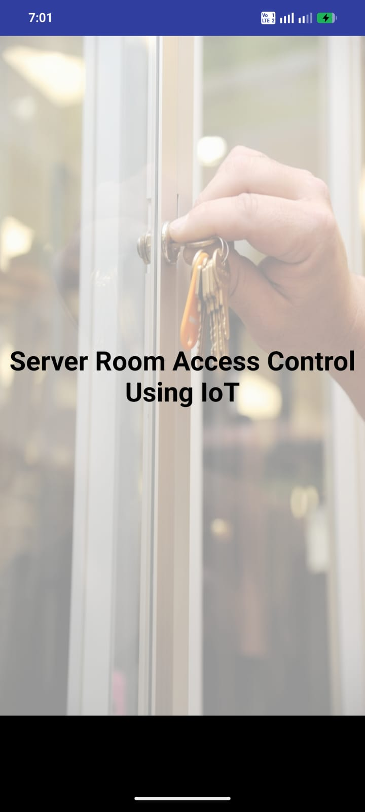
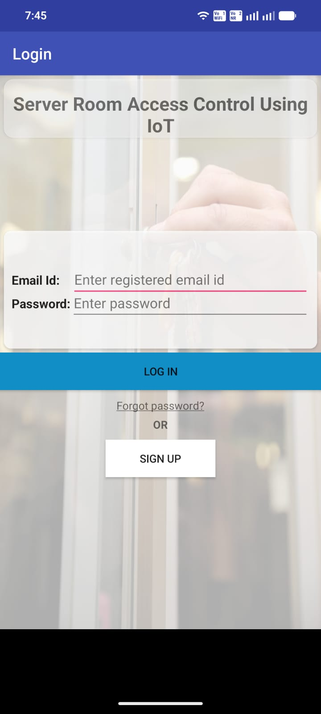
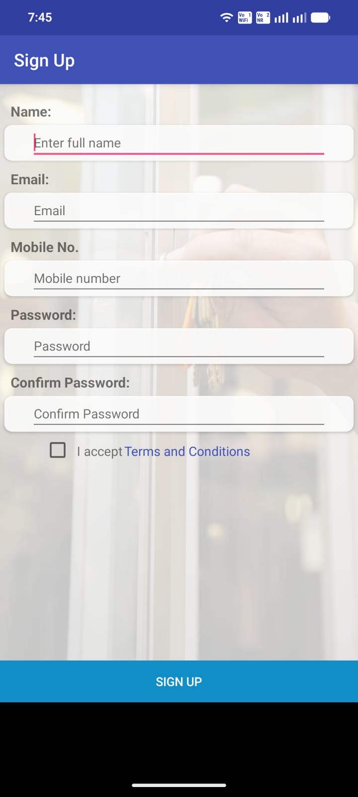
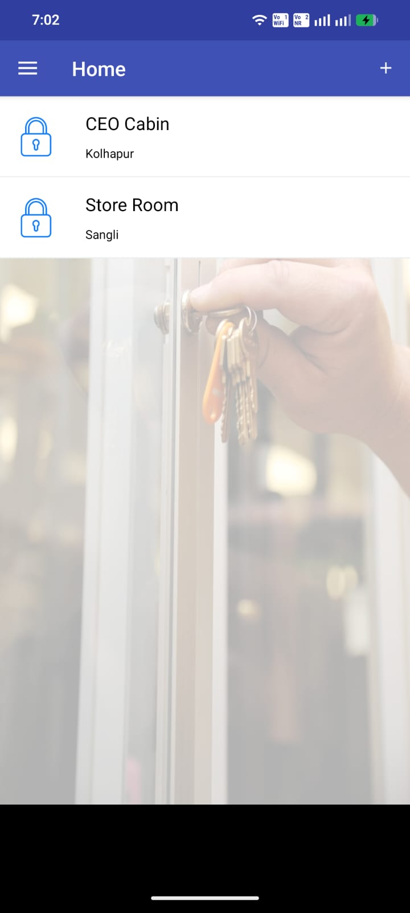
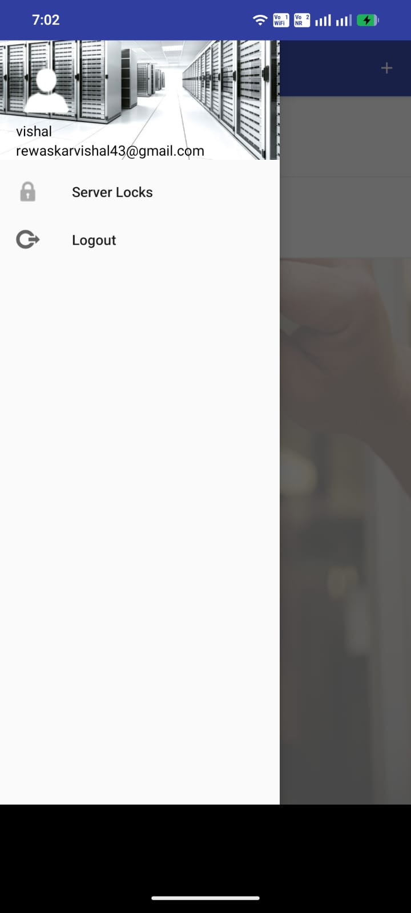
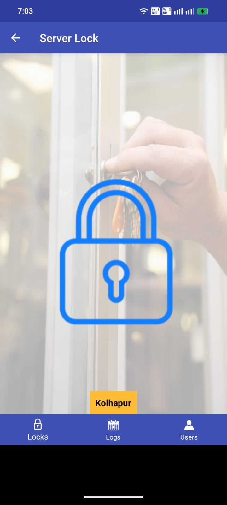
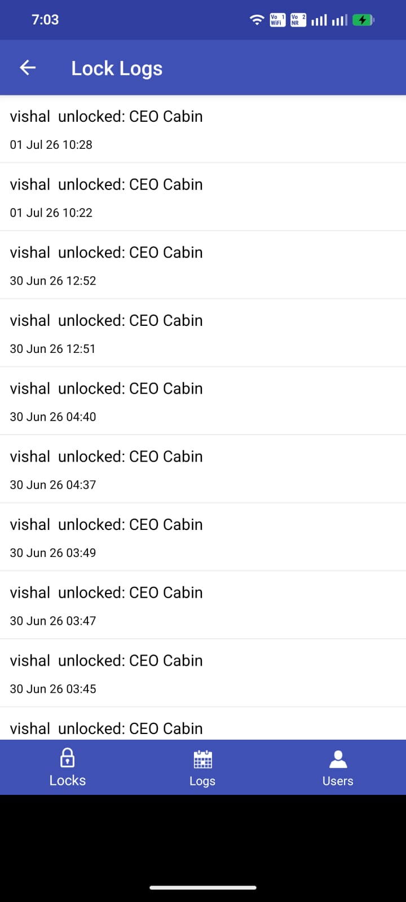
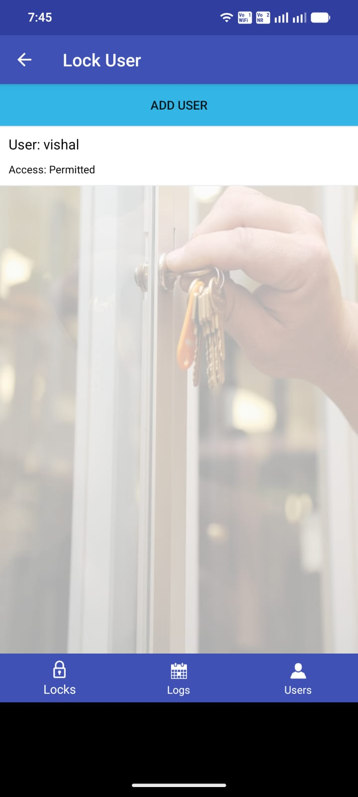
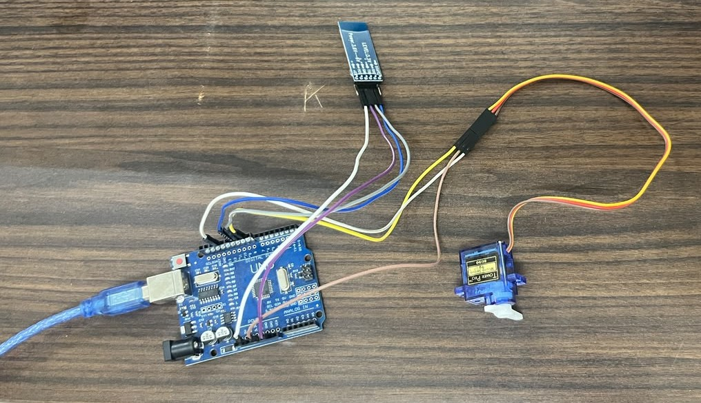

# 🔐 Server Room Access Control System

An Android-based IoT smart door lock system that enables secure and reliable access management for server rooms using **Arduino**, **Bluetooth (HC-05)**, and **Firebase**.

The application allows administrators to register server room locks, authorize users, remotely control locks via Bluetooth, and maintain a complete audit trail of every access event through a simple and intuitive Android application.

---

## ✨ Key Features

- 🔐 Secure user authentication
- 🚪 Bluetooth-based door lock control
- 👥 Multi-user access management
- 📝 Real-time access history and audit logs
- 🏢 Register and manage multiple server room locks
- ☁ Cloud-based data synchronization
- 📱 Simple and user-friendly Android interface

---

# 📸 Application Screenshots

<p align="center">
<a href="images/open.jpeg">

</a>

<a href="images/log_in.jpeg">

</a>

<a href="images/sign_in.jpeg">

</a>

<a href="images/home.jpeg">

</a>
</p>

<p align="center">
<a href="images/sidebar.jpeg">

</a>

<a href="images/lock.jpeg">

</a>

<a href="images/logs.jpeg">

</a>

<a href="images/add_user.jpeg">

</a>
</p>

---

# ⭐ Project Highlights

- Android application developed using **Java**
- IoT-based smart door lock system using **Arduino Uno**
- Bluetooth communication through **HC-05**
- Firebase Authentication for secure user login
- Firebase Realtime Database for cloud synchronization
- Multi-user permission management
- Real-time lock activity logging
- Modular and scalable project architecture

---

# 🔧 Hardware Setup

The hardware prototype consists of:

- Arduino Uno
- HC-05 Bluetooth Module
- SG90 Servo Motor (Door Lock Simulation)
- Jumper Wires
- USB Power Supply

<p align="center">

</p>

---

# 🏗 System Architecture

```text
                Android Application
                        │
                        │
              Bluetooth (HC-05)
                        │
                        ▼
                 Arduino Uno Board
                        │
                        ▼
                  Servo Motor Lock
                        │
                        ▼
                  Server Room Door

        Firebase Authentication & Database
                  │
                  ▼
      User Accounts • Lock Data • Activity Logs
```

---

# 🛠 Tech Stack

| Category | Technology |
|-----------|------------|
| Mobile Application | Java, Android Studio |
| Cloud Backend | Firebase Authentication, Firebase Realtime Database |
| Communication | Bluetooth (HC-05) |
| Hardware | Arduino Uno, SG90 Servo Motor |
| UI Components | Material Design, AndroidX |

---

# 🚀 Application Modules

| Module | Description |
|---------|-------------|
| 🔑 Authentication | Secure login and account registration |
| 🏠 Dashboard | Displays all registered server room locks |
| ➕ Register Lock | Register and configure new smart locks |
| 🔒 Lock Control | Lock and unlock doors through Bluetooth |
| 👥 User Management | Add and manage authorized users |
| 📝 Activity Logs | View complete lock and unlock history |
| ☁ Cloud Sync | Synchronize users, locks, and logs with Firebase |

---

# 📂 Project Structure

```text
Server-Room-Access-Control/
│
├── app/
│   ├── src/
│   ├── res/
│   └── build.gradle
│
├── arduino/
│   └── arduino011.ino
│
├── images/
├── gradle/
├── README.md
└── build.gradle
```

---

# ⚙ Requirements

### Software

- Android Studio
- Java JDK 8+
- Android SDK
- Firebase Project

### Hardware

- Arduino Uno
- HC-05 Bluetooth Module
- SG90 Servo Motor
- Jumper Wires
- USB Cable

---

# 🚀 Getting Started

## 1️⃣ Clone the Repository

```bash
git clone https://github.com/Vishalrewaskar/Door-Lock-System.git
```

---

## 2️⃣ Open in Android Studio

Open the cloned project using **Android Studio** and allow Gradle to synchronize.

---

## 3️⃣ Configure Firebase

1. Create a Firebase project.
2. Enable **Authentication**.
3. Enable **Realtime Database**.
4. Download `google-services.json`.
5. Place it inside the `app/` directory.

> **Note:**  
> `google-services.json` is excluded from the repository for security reasons.

---

## 4️⃣ Upload Arduino Firmware

Upload the provided Arduino sketch:

```text
arduino/arduino011.ino
```

to your Arduino Uno board.

---

## 5️⃣ Run the Application

- Pair your Android device with the HC-05 Bluetooth module.
- Build and install the application.
- Log in and start controlling your server room lock.

---

# 🔄 Application Workflow

```text
          User Login
               │
               ▼
      Select Registered Lock
               │
               ▼
     Connect via Bluetooth
               │
               ▼
       Lock / Unlock Door
               │
               ▼
   Store Activity in Firebase
               │
               ▼
      View Logs & Manage Users
```

---

# 📦 Dependencies

The project uses the following libraries:

- AndroidX
- Material Components
- Firebase Authentication
- Firebase Realtime Database
- CircleImageView
- SwipeLayout

---

# 🔑 Permissions

The application requires access to:

- Bluetooth
- Nearby Devices
- Internet

---

# 🚀 Future Enhancements

- ESP32 / Wi-Fi Support
- Biometric Authentication
- Push Notifications
- QR Code-Based Access
- OTP Verification
- Remote Lock Management
- Role-Based Access Control
- Admin Dashboard
- Analytics & Reports

---

# 🤝 Contributing

Contributions are always welcome!

1. Fork the repository.
2. Create a feature branch.

```bash
git checkout -b feature-name
```

3. Commit your changes.

```bash
git commit -m "Add new feature"
```

4. Push your branch.

```bash
git push origin feature-name
```

5. Open a Pull Request.

---

# 📄 License

This project is licensed under the **MIT License**.

Feel free to use, modify, and distribute this project in accordance with the license terms.

---
